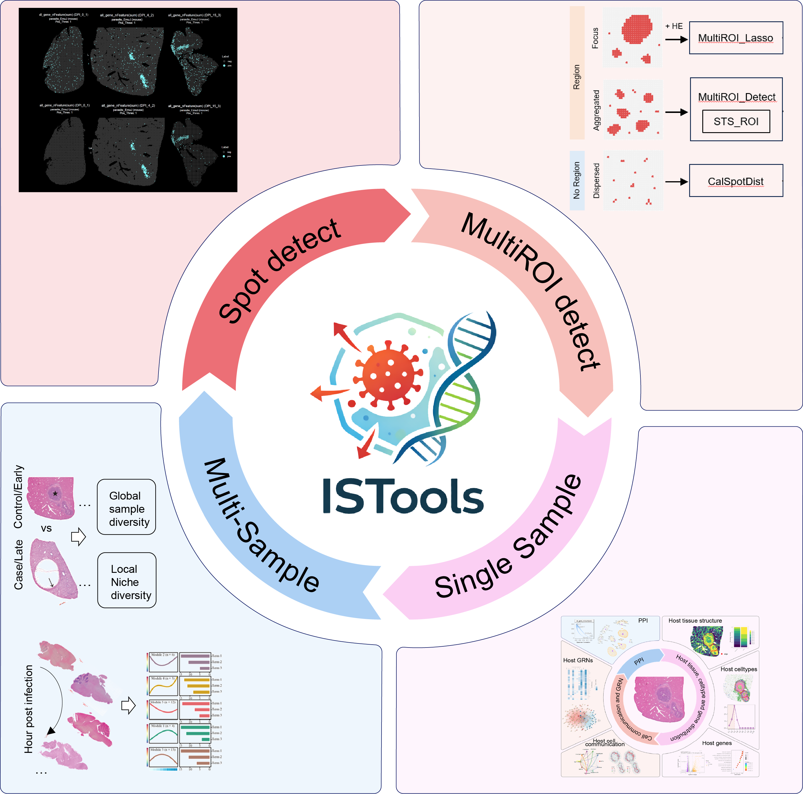

<!-- README.md is generated from README.Rmd. Please edit that file -->

# ISTools: Infectious Spatiotemporal Transcriptomics Tools

<!-- badges: start -->

<!-- badges: end -->

## Overview

ISTools is an R-based toolkit designed to provide a unified and
efficient framework for spatial transcriptomics analysis in infectious
diseases, built upon the Seurat object. While spatial transcriptomics is
increasingly applied to explore disease mechanisms, including infection,
a standardized analytical framework and user-friendly tools tailored for
infectious disease research remain lacking. ISTools addresses this gap
by defining a comprehensive analytical pipeline specifically for
infection-related spatial transcriptomics data. The toolkit encompasses
four main applications: accurate detection of infection sites,
characterization of the infection microenvironment, single-sample Niche
analysis, and cross-sample comparative or temporal analysis. By
integrating these functions into a cohesive framework, ISTools enhances
researchers’ ability to interpret and mine infection-related spatial
transcriptomics data with both rigor and ease.

<div align="center">



Graphic abstract

</div>

### Key Features:

- Unified Analytical Framework: Provides a standardized pipeline
  tailored for infection spatial transcriptomics data storage,
  management, and processing.
- Accurate Infection Site Detection: Enables precise localization of
  pathogen-infected regions.
- Microenvironment Characterization: Facilitates identification and
  analysis of the infection microenvironment.
- Niche and Comparative Analysis: Supports single-sample Niche analysis
  as well as multi-sample comparison or time-series analysis.

## Installation

### Configure mirrors

To ensure stable and fast installation, users may configure CRAN and
Bioconductor mirrors depending on their location.

``` r
# Recommended for users in China
options("repos" = c(CRAN="https://mirrors.tuna.tsinghua.edu.cn/CRAN/"))
options(BioC_mirror="https://mirrors.tuna.tsinghua.edu.cn/bioconductor")

# Recommended for users outside China
options("repos" = c(CRAN="https://cloud.r-project.org"))
options(BioC_mirror = "https://bioconductor.org")
```

### Prepare library path

Given the number of dependencies, it is strongly recommended to use an
isolated library path.

``` r
.libPaths("./library_ISTools/")  # modify as needed
.libPaths()
```

This prevents conflicts with existing R environments and improves
reproducibility.

### Install ISTools

``` r
if (!requireNamespace("remotes", quietly = TRUE)) {
    install.packages("remotes")
}

remotes::install_github("YulongQin/ISTools")
```

> Installation from source is recommended and may take approximately
> 20–30 minutes depending on system configuration.

If the installation fails, please refer to the [installation
tutorial](https://yulongqin.github.io/ISTools/articles/01_Installation.html)
for manual dependency setup

## Quick Start

You can click
[here](https://yulongqin.github.io/ISTools/articles/00_Quick_Start.html)
to access the quick start tutorial, which provides a concise overview of
the main functions and workflow of ISTools.

For a more detailed step-by-step guide, please refer to the following
tutorials:

- [01_Installation](https://yulongqin.github.io/ISTools/articles/01_Installation.html)
- [02_PreProcssing](https://yulongqin.github.io/ISTools/articles/02_PreProcssing.html)
- [03_Background_correction](https://yulongqin.github.io/ISTools/articles/03_Background_correction.html)
- [04_Infection_spot_detection](https://yulongqin.github.io/ISTools/articles/04_Infection_spot_detection.html)
- [05_Infection_niche_detection](https://yulongqin.github.io/ISTools/articles/05_Infection_niche_detection.html)
- [06_SingleSampNiche_analysis](https://yulongqin.github.io/ISTools/articles/06_SingleSampNiche.html)
- [07_MultiSampNiche_analysis](https://yulongqin.github.io/ISTools/articles/07_MultiSampNiche.html)

## Resources

### Project

- GitHub Repository: Access the source code and contribute to ISTools on
  [GitHub](https://github.com/YulongQin/ISTools.git).

### Tutorials

- Online Tutorial: For a comprehensive guide on using ISTools, visit our
  [tutorial website](https://yulongqin.github.io/ISTools/).

### Raw data

- Gene_Geneset: A dataset containing gene and gene set information,
  available in the [R
  package](https://github.com/YulongQin/ISTools/blob/d305ee31337ee7290981a50ed08cd74746a1ff70/data/Gene_Geneset.rda).
- Raw data: You can access the Raw data used in the tutorial from the
  [Figshare repository](https://doi.org/10.6084/m9.figshare.31839988).
  Some data are unavailable or partially available due to constraints
  set by the original authors. Please contact the original authors for
  data access requests.

## Citation

If you use ISTools in your research, please cite:

Qin Y (2026). *ISTools: Infectious Spatiotemporal Transcriptomics
Tools*. <https://github.com/YulongQin/ISTools.git>,
<https://yulongqin.github.io/ISTools/>,
<https://github.com/YulongQin/ISTools>.
